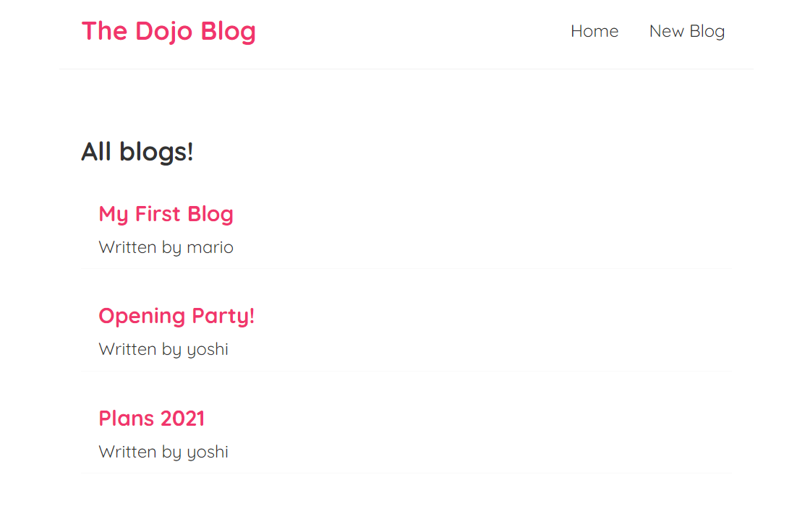

# Blog Simple Application

> Using:
>
> - create-react-app
> - Multiple Components
> - useState Hook
> - Reusing Components
> - useEffect Hook
> - JSON Server
> - Fetching Data (GET, POST, DELETE)
> - Custom Hook
> - React Router (programmatic redirects)
> - Router Links
> - 404 Pages

## Preview application

